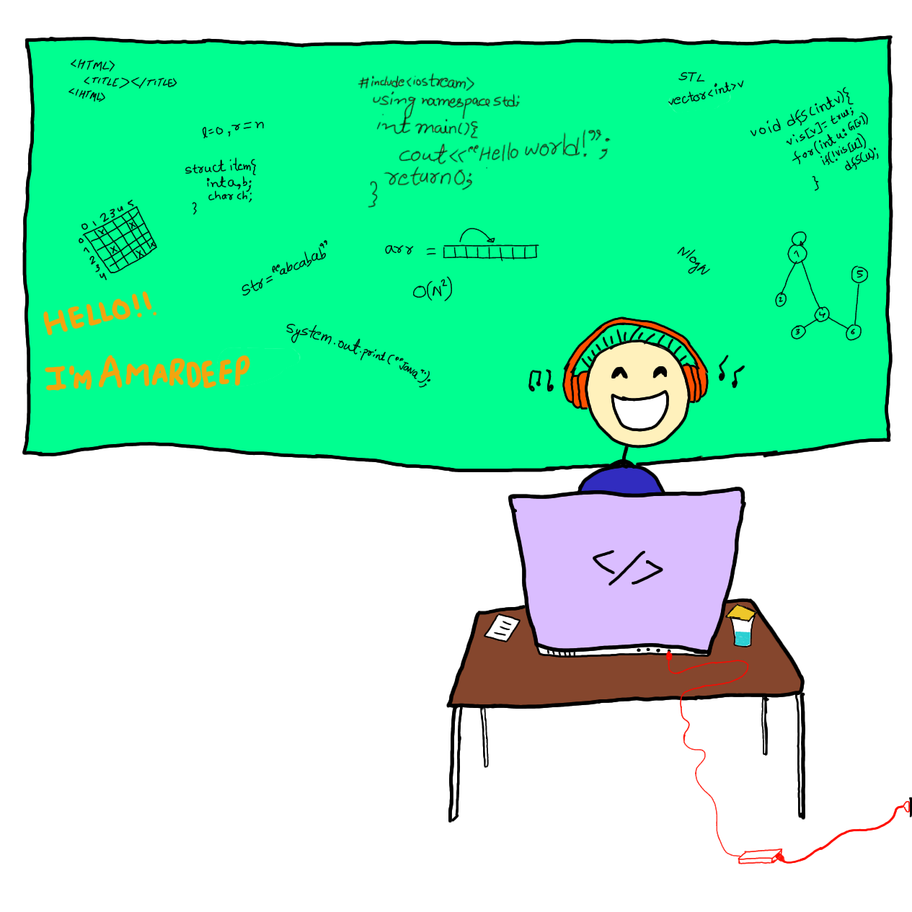

<h3 align = "center">Hello!, I'm Amardeep 👋 </h3>

        
        <!-- 
 -->
            <button class="btn1"></button> 
            
            <button class="btn2"></button>  
            
            <button class="btn3"></button>

